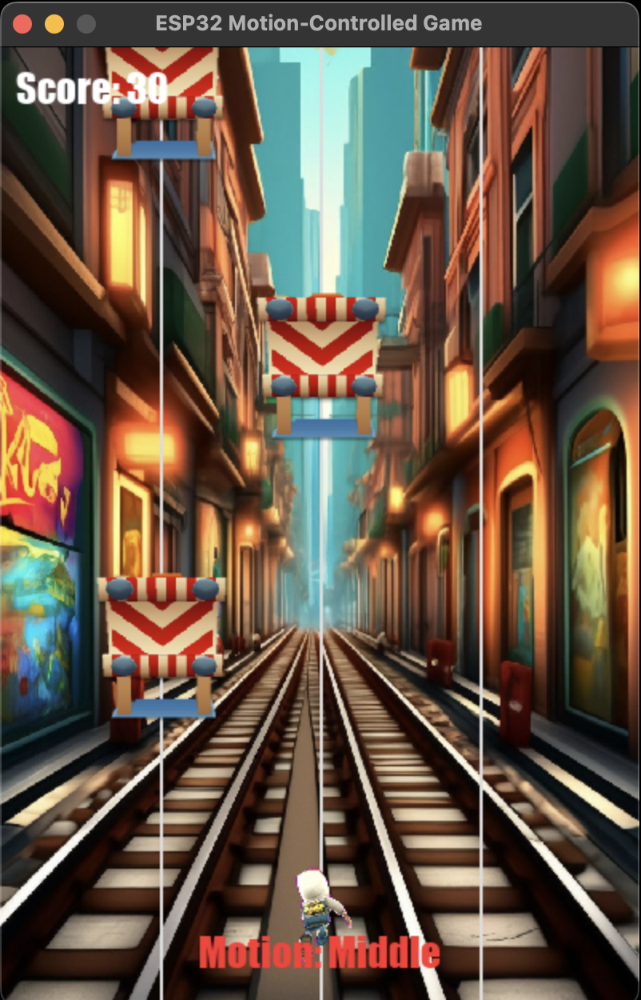

# [BitHacks 2025](https://devpost.com/software/fitness-surfers)

# Fitness Surfers
A motion-controlled, AI-powered arcade game that turns your body movements into high-stakes dodges! Think Subway Surfers meets real-life fitness and Gemini AI encouragement.

---

## Preview

> **Move left and right in real life to dodge obstacles in the game. If you fail, Gemini AI delivers a clever joke to cheer you up. Stay active, stay entertained.**

---

## Inspiration

We wanted to gamify fitness and make exercising more fun and encouraging. By combining physical motion sensors, AI feedback, and retro-style gameplay, we created a unique fusion of **gaming, movement, and motivation**.

---

## Features

- Motion-controlled gameplay using **PIR sensors**
- Real-time **AI coaching prompts** via Google Gemini
- Animated obstacles and GIF-based player character
- Background music, sound effects, and collision audio
- AI-generated jokes on game over

---

## Tech Stack

### Software

| Tool / Language | Use |
|-----------------|-----|
| **Python 3.13.1+** | Core game logic |
| **Pygame** | Graphics and animation |
| **Google genai** | AI-based prompts and jokes |
| **Serial (pyserial)** | Communication with ESP32 |
| **Pillow (PIL)** | GIF frame handling |
| **pygame.mixer** | Audio effects |
| **PlatformIO (C++)** | ESP32 firmware for reading PIR sensor input |

---

## IDEs & Tools

| Tool | Purpose |
|------|---------|
| **VS Code** + **PlatformIO** | Embedded development for ESP32-S3 |
| **VS Code** | Python development (game + AI integration) |
| **Terminal / cmd** | Serial communication testing |

---

## Hardware

| Component | Purpose |
|----------|---------|
| **ESP32-S3 Dev Board** | Microcontroller to read sensor input |
| **2x PIR Motion Sensors** | Detect body movement (left/right) |
| **Male-to-Female Jumper Wires** | Connect sensors to ESP32 |
| **Breadboard** | Sensor placement (optional but helps) |
| **Micro-USB Cable** | Power & data for ESP32-S3 |
| **PC or Laptop** | Runs the game and AI integration |
